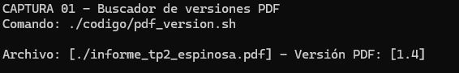
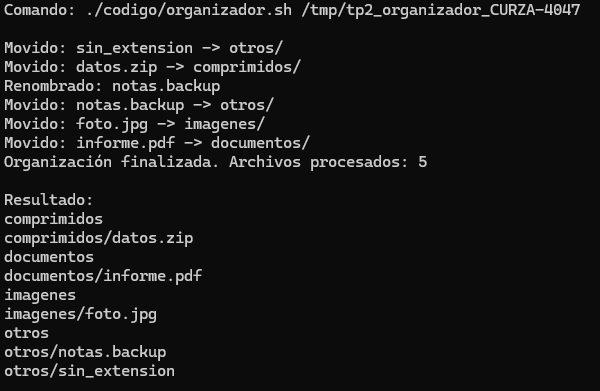
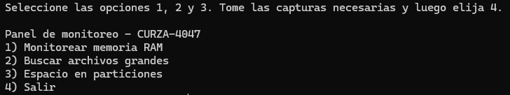
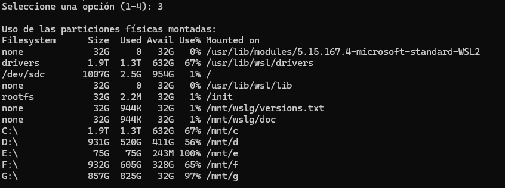
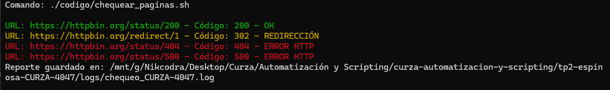
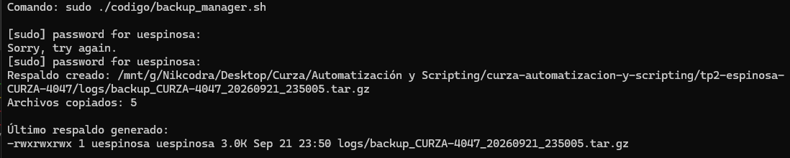

# Trabajo Práctico 2 - Scripts avanzados en Bash

Alumno: Ulises Espinosa  
Legajo: CURZA-4047  
Asignatura: Automatización y Scripting

## Objetivo

Resolver las cinco tareas de automatización solicitadas mediante scripts Bash ejecutados y probados en Ubuntu.

## Contenido

- `codigo/pdf_version.sh`: busca archivos PDF e informa su versión.
- `codigo/organizador.sh`: clasifica archivos según su extensión.
- `codigo/monitorear.sh`: presenta un menú interactivo de monitoreo.
- `codigo/chequear_paginas.sh`: consulta códigos HTTP y genera un log.
- `codigo/backup_manager.sh`: crea un respaldo con bloqueo contra ejecuciones simultáneas.
- `sitios_CURZA-4047.txt`: URLs utilizadas para probar el verificador.
- `logs/`: reportes y respaldos generados durante las pruebas.

## Ejecución

Requisitos: Bash, `find`, `head`, `curl`, `free`, `df`, `tar` y permisos de
administración para crear el bloqueo en `/var/lock`.

Desde esta carpeta, dar permiso de ejecución si fuera necesario:

```bash
chmod +x codigo/*.sh
```

### 1. Buscar versiones de PDF

El recorrido comienza en el directorio actual y abarca sus subdirectorios.

```bash
./codigo/pdf_version.sh
```

### 2. Organizar archivos

El script recibe un único directorio existente y accesible.

```bash
./codigo/organizador.sh /ruta/al/directorio
```

Si falta el argumento o la ruta no es válida, termina con código `1`.

### 3. Monitorear recursos

```bash
./codigo/monitorear.sh
```

El menú se repite hasta seleccionar `4) Salir`. Las opciones muestran memoria,
los cinco archivos mayores a 10 MB y el uso de las particiones montadas.

### 4. Verificar sitios web

Sin argumentos lee `sitios_CURZA-4047.txt`:

```bash
./codigo/chequear_paginas.sh
```

También acepta URLs separadas por espacios:

```bash
./codigo/chequear_paginas.sh https://httpbin.org/status/200 https://httpbin.org/status/404
```

El resultado se muestra con colores en una terminal compatible y también se
guarda, sin secuencias de color, en `logs/chequeo_CURZA-4047.log`.

### 5. Crear un respaldo

```bash
sudo ./codigo/backup_manager.sh
```

El permiso elevado se necesita únicamente para el directorio de bloqueo en
`/var/lock`. Una segunda instancia finaliza con código `9`. El archivo resultante
queda en `logs/backup_CURZA-4047_FECHA.tar.gz`.

## Pruebas realizadas

Los cinco scripts fueron ejecutados en Ubuntu 24.04. Se verificó la sintaxis, los
permisos de ejecución, el filtrado de PDF, la clasificación de archivos, las
cuatro opciones del menú, los estados HTTP 200/302/404/500, el contenido del
respaldo y el código de salida `9` ante una segunda ejecución.

## Capturas de ejecución

Todas las imágenes siguientes corresponden a ejecuciones reales en Ubuntu.

### Buscador de versiones PDF



### Organizador automático



### Monitor interactivo





### Verificador de sitios web



### Respaldador


